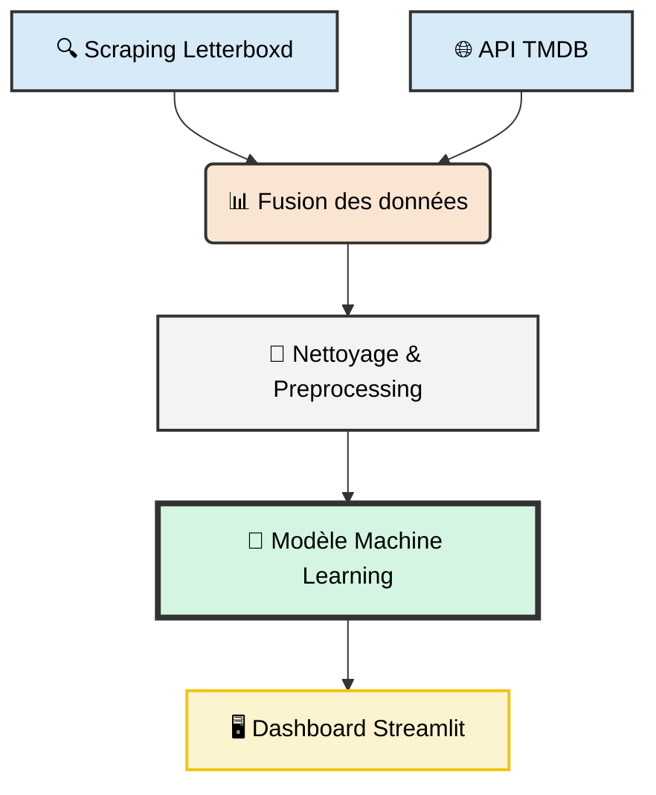

<div align="center">
  <h1>🎬 Letterboxd Insights : Prédire le Succès Cinématographique </h1>
  <p><i>Prédire le succès critique grâce au Web Scraping et au Machine Learning</i></p>

  
  
  
    <br>
  
  
  
  

</div>

---

## Table des matières

* [📝 Pitch du Projet](#-pitch-du-projet)
* [⚙️ Architecture Technique](#️-architecture-technique)
* [⛏️ Acquisition & Enrichissement des Données](#️-acquisition--enrichissement-des-données)
    * [1. Web Scraping (Letterboxd)](#1-web-scraping-letterboxd)
    * [2. Enrichissement via API (TMDB)](#2-enrichissement-via-api-tmdb)
* [🧹 Nettoyage & Preprocessing](#-nettoyage--preprocessing)
    * [1. Data Cleaning](#1-data-cleaning)
    * [2. Feature Engineering](#2-feature-engineering)
* [🤖 Machine Learning](#-machine-learning)
    * [🎯 Objectif de Modélisation](#-objectif-de-modélisation)
    * [🧪 Processus de Sélection & Optimisation](#-processus-de-sélection--optimisation)
    * [📊 Les Variables Explicatives](#-les-variables-explicatives)
    * [🏹 Prédictions & Inférence](#-prédictions--inférence)
* [🚀 Installation & Utilisation](#-installation--utilisation)
* [🖥️ Navigation dans l'Application](#️-navigation-dans-lapplication)
* [👥 Auteurs](#-auteurs)

---

## 📝 Pitch du Projet
Est-il possible d'anticiper la note d'un film avant même sa sortie ? En exploitant les données de la communauté **Letterboxd** et en les enrichissant avec l'API **TMDB**, nous avons conçu un modèle capable d'identifier les facteurs clés du succès critique (casting, budget, genre) et de prédire la réception d'une œuvre.

---

## ⚙️ Architecture Technique

Le projet repose sur un pipeline de données modulaire, garantissant une séparation claire entre l'acquisition et l'exploitation des données :



---

## ⛏️ Acquisition & Enrichissement des Données

La constitution de notre base de données repose sur une stratégie hybride. L'objectif était de coupler la richesse des données sociales de **Letterboxd** avec la précision des données financières de **TMDB**.

### 1. Web Scraping (Letterboxd)
Nous avons conçu un scraper capable de naviguer à travers les catalogues pour extraire l'essence communautaire des films.

* **Technologies :** `Playwright` pour la navigation dynamique et `BeautifulSoup` pour le parsing HTML.
* **Données extraites :**
    * **Identifiants :** Clés uniques pour la jointure API.
    * **Social :** Note moyenne des utilisateurs, nombre de "likes", popularité, etc.
    * **Équipe :** Casting complet, Réalisateurs, Studios de production, etc.
    * **Informations :** Durée complète, genre, thèmes, langue originale, année de sortie, etc. 

### 2. Enrichissement via API (TMDB)
Pour construire un modèle de Machine Learning robuste, nous avons enrichi le dataset initial en interrogeant **The Movie Database** et son API.

* **Processus de matching :** Pour chaque film scrapé, le script effectue une requête de recherche combinant `title` + `year`. Une fois l'ID TMDB confirmé, les détails complets sont récupérés.
* **Variables récupérées :** 
    * **Finances :** Budget de production et Revenus mondiaux (Box Office).
    * **Illustrations :** Depuis l'API on récupère les affiches des films, ainsi que les photos des acteurs/réalisateurs. 

---

## 🧹 Nettoyage & Preprocessing

Avant l'étape de modélisation, les données brutes ont subi un traitement rigoureux pour garantir la stabilité et la précision de nos prédictions.

### 1. Data Cleaning
Le nettoyage s'est concentré sur l'uniformisation des données hétérogènes :
* **Formats Numériques** : Conversion des colonnes `Budget` et `Revenue` (nettoyage des symboles monétaires et passage en format numérique).
* **Gestion des valeurs manquantes** : Identification et traitement des valeurs manquantes par suppression (si critiques) ou imputation statistique (médiane pour les variables financières).
* **Déduplication** : Nettoyage des doublons potentiels issus des sessions de scraping successives.

### 2. Feature Engineering
Pour enrichir le modèle, nous avons transformé les données textuelles en variables quantitatives :
* **Vectorisation des Genres** : Utilisation d'un encodage multi-label pour gérer les films appartenant à plusieurs catégories (ex: Sci-Fi + Thriller).
* **Encodage de l'Influence (Casting & Réalisateurs)** : Contrairement à un encodage classique, nous avons associé un **poids numérique** à chaque nom. Ce score permet au modèle de quantifier l'impact statistique d'un réalisateur ou d'un acteur sur la note finale, transformant une donnée textuelle en une mesure de "notoriété" exploitable par l'algorithme.
* **Mise à l'échelle (Scaling)** : Utilisation d'un `StandardScaler` de `Scikit-Learn` pour normaliser les variables numériques (Budget, Revenus, Durée) et éviter que les grands écarts de grandeur ne biaisent les prédictions.

---

## 🤖 Machine Learning

Cette section détaille le cœur algorithmique du projet, de la définition de l'objectif à la sélection du modèle final.

### 🎯 Objectif de Modélisation
L'enjeu principal est de prédire la **note moyenne** d'un film (variable continue sur une échelle de 0.5 à 5) en fonction de ses caractéristiques de pré-production.

### 🧪 Processus de Sélection & Optimisation
Pour garantir la fiabilité de nos prédictions, nous avons suivi une démarche rigoureuse :

1. **Benchmark de Modèles** : Nous avons mis en compétition plusieurs algorithmes (Régression Linéaire, Arbres de Décision, Random Forest, Gradient Boosting) afin de comparer leurs performances.
2. **Choix du Modèle** : Le **Meilleur Modèle** a été sélectionné sur la base du score R² et de l'erreur moyenne.
3. **Validation Croisée** : Le modèle a été entraîné et validé sur différents segments du dataset pour s'assurer qu'il ne fait pas d'overfitting (apprentissage par cœur).
4. **Optimisation des Hyperparamètres** : Ajustement de la structure du modèle (ex: profondeur des arbres, nombre d'estimateurs) pour maximiser sa capacité de généralisation.

### 📊 Les Variables Explicatives
Le modèle s'appuie sur les variables clés extraites lors de la phase de scraping et d'enrichissement :

| Catégorie | Variables (données brutes) | Impact sur la Prédiction |
| :--- | :--- | :--- |
| **Identité** | `directors`, `casting`, `year` | Influence de la réputation du cinéaste et de l'époque du film. |
| **Technique** | `genres`, `duration` | Typologie du film et format (court vs long métrage). |
| **Production** | `studio`, `languages`, `writers` | Impact des moyens de production et de l'origine culturelle. |
| **Social Letterboxd** | `nbr_watched`, `nbr_likes`, `fans_favoris` | Mesure de l'engagement et de la popularité auprès de la communauté. |
| **Visibilité** | `nbr_appearence` | Indicateur de "curation" (nombre d'apparitions dans des listes publiques). |
| **Économique** | `budget`, `revenue` | Puissance financière et rentabilité commerciale (via TMDB). |

### 🏹 Prédictions & Inférence
Une fois entraîné et optimisé, le modèle est capable de traiter de nouvelles données via notre interface. Lorsqu'un utilisateur saisit les caractéristiques d'un film, le pipeline applique le preprocessing en temps réel et génère la **note prédite** avec un intervalle de confiance basé sur nos tests de performance.

---

## 🚀 Installation & Utilisation

Suivez ces étapes pour lancer le projet et l'interface de prédiction sur votre machine locale.

En utilisant Visual Studio Code, ouvrez le terminal (`git bash` ou `powershell`) avec `ctrl + ù`.

### 1. Clonage du dépôt
```powershell
git clone [https://github.com/Dumont-Roty/WSML_project.git](https://github.com/Dumont-Roty/WSML_project.git)
cd WSML_project
```

### 2. Création de l'environnement virtuel 
Nous utilisons un environnement isolé pour garantir la compatibilité des bibliothèques (Pandas, Scikit-Learn, Streamlit) :

```powershell
# Création de l'environnement
python -m venv .venv
# Installation des dépendances
.\.venv\Scripts\python.exe -m pip install -r ml/requirements.txt
.\.venv\Scripts\python.exe -m playwright install chromium
```

### 3. Pipeline de Données (Workflow Complet)
Si vous souhaitez reconstruire le modèle de zéro, suivez ces trois étapes :

#### Scraping

```powershell
# Définir le chemin source
$env:PYTHONPATH = 'src'
# Lancer un scraping parallèle (ex: 40 pages)
.\.venv\Scripts\python.exe ./scripts/scrape_single_genre_grids.py --max-pages 40 --output movies.json
# Enrichir avec les données budgétaires TMDB
./.venv/Scripts/python ./scripts/targeted_update_tmdb.py --input missing_tmdb.csv --output missing_tmdb_updated.csv --delay 0.2
```
**Note :** Pour visualiser le scraping en temps réel, ajoutez l'option `--headless False`.

#### Préparation & Nettoyage

Fusion des fichiers récupérés et transformation en dataset exploitable.
Le script de fusion regroupe tous les fichiers `results_*.json` (racine) ou ceux du dossier `results/`.

```powershell
# Fusion des résultats
./.venv/Scripts/python ./scripts/merge_results.py
# Nettoyage et split (Train/Test)
./.venv/Scripts/python ./src/ml/cleaning_movies.py --input ml/data/partial_result_<date>.json --output ml/data/cleaned_data.parquet
./.venv/Scripts/python ./src/ml/prepare_dataset.py --data ml/data/cleaned_data.parquet --out-train ml/data/train.parquet --out-test ml/data/test.parquet
```
**Sortie :** Un fichier `ml/data/partial_result_<date>.json` est généré.

#### Entraînement du Modèle

```powershell
./.venv/Scripts/python ./src/ml/optimize_model.py --train ml/data/partial_result_<date>.json --test-size 0.2 --target rating --clip-predictions --use-identities
```

**Sorties générées :**
  * `ml/models/best_model.joblib` : Le modèle entraîné (utilisé par l'App).
  * `ml/models/metrics.json` : Les performances du modèle (R², RMSE).

### 4. Lancement de l'Application
Une fois l'installation terminée, lancez l'interface interactive :

```powershell
.\.venv\Scripts\python.exe -m streamlit run streamlit_app/app.py
```
🎉 Félicitations, l'application devrait se lancer dans votre navigateur à l'adresse http://localhost:8501.


---

## 🖥️ Navigation dans l'Application

L'interface Streamlit est divisée en 5 onglets thématiques pour offrir une expérience complète, de l'exploration brute à la prédiction interactive.

### Onglet 1 : Présentation
* **Contenu** : Introduction au projet, contexte du Master MECEN et vue d'ensemble de la synergie entre le scraping Letterboxd et TMDB.
* **Objectif** : Comprendre en un coup d'œil la valeur ajoutée de l'outil.

### Onglet 2 : Estimateur Letterboxd 
* **Fonctionnalité** : Moteur de prédiction en temps réel.
* **Utilisation** : L'utilisateur saisit les caractéristiques d'un film (Réalisateur, Budget, Genres, Casting). 
* **Résultat** : Le modèle génère une estimation de la **note moyenne**.

### Onglet 3 : Exploration des Données
* **Contenu** : Visualisations interactives du dataset scrapé.
* **Analyses** : Corrélations entre budget et notes, distribution des genres, et statistiques descriptives sur la communauté Letterboxd.

### Onglet 4 : Outils & Jeux
* **Statut** : *En cours de développement.*

### Onglet 5 : À Propos
Une section détaillée pour la transparence scientifique du projet :
* **Objectif & Données** : Origine des données (Letterboxd + TMDB).
* **Choix de Modélisation** : Explication du benchmark des modèles et justification du choix de l'algorithme le plus performant (meilleur score R²/RMSE).
* **Limites** : Analyse des biais potentiels (ex: films très récents avec peu de notes) et perspectives d'amélioration technique.

---

## 👥 Auteurs

Ce projet a été réalisé par :
[@Rachel Mellot](https://github.com/RachelMellot) &
[@Pierre Dumont-Roty](https://github.com/Dumont-Roty).

---

<div align="center">
  <p>Projet réalisé dans le cadre du Master MECEN</p>
</div>