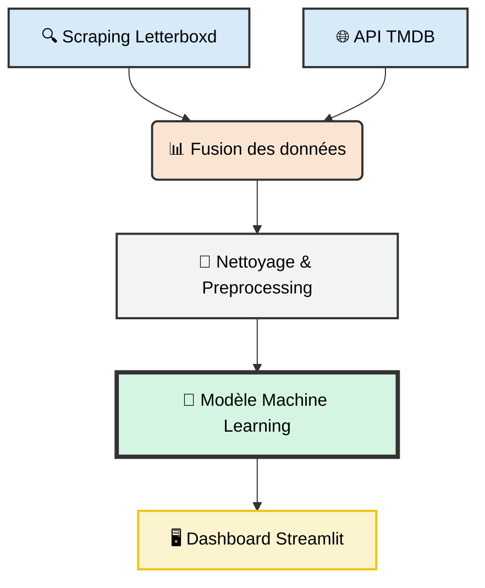

  <h1>🎬 Letterboxd Insights : Prédire le Succès Cinématographique </h1>
  
<i>Prédire le succès critique grâce au Web Scraping et au Machine Learning</i>

  
  
  
     
  
  
  
  

---

## 📝 Pitch du Projet
Est-il possible d'anticiper la note d'un film avant même sa sortie ? En exploitant les données de la communauté **Letterboxd** et en les enrichissant avec l'API **TMDB**, nous avons conçu un modèle capable d'identifier les facteurs clés du succès critique (casting, budget, genre) et de prédire la réception d'une œuvre.

---

## ⚙️ Architecture Technique
Le projet repose sur un pipeline de données modulaire, garantissant une séparation claire entre l'acquisition et l'exploitation des données :

---

## ⛏️ Acquisition & Enrichissement des Données

La constitution de notre base de données repose sur une stratégie hybride. L'objectif était de coupler la richesse des données sociales de **Letterboxd** avec la précision des données financières de **TMDB**.

### 1. Web Scraping (Letterboxd)
Nous avons conçu un scraper capable de naviguer à travers les catalogues pour extraire l'essence communautaire des films.

* **Technologies :** `Playwright` pour la navigation dynamique et `BeautifulSoup` pour le parsing HTML.
* **Données extraites :**
    * **Identifiants :** Clés uniques pour la jointure API.
    * **Social :** Note moyenne des utilisateurs, nombre de "likes" et popularité hebdomadaire, etc.
    * **Équipe :** Casting complet, Réalisateurs et Studios de production, etc.
    * **Informations :** Durée complète, genre, thèmes, langue originale, etc. 

### 2. Enrichissement via API (TMDB)
Pour construire un modèle de Machine Learning robuste, nous avons enrichi le dataset initial en interrogeant l'API **The Movie Database**.

* **Processus de matching :** Pour chaque film scrapé, le script effectue une requête de recherche combinant `title` + `year`. Une fois l'ID TMDB confirmé, les détails complets sont récupérés.
* **Variables récupérées :** 
    * **Finances :** Budget de production et Revenus mondiaux (Box Office).
    * **Indicateurs :** Score de popularité TMDB et note moyenne (permettant de comparer les deux plateformes).
    * **Métadonnées :** Liste des genres, durée exacte (runtime), etc. 

---

## 🧹 Nettoyage & Preprocessing

Avant l'étape de modélisation, les données brutes ont subi un traitement rigoureux pour garantir la stabilité et la précision de nos prédictions.

### 1. Data Cleaning
Le nettoyage s'est concentré sur l'uniformisation des données hétérogènes :
* **Formats Numériques** : Conversion des colonnes `Budget` et `Revenue` (nettoyage des symboles monétaires et passage en format numérique).
* **Gestion des valeurs manquantes** : Identification et traitement des valeurs manquantes par suppression (si critiques) ou imputation statistique (médiane pour les variables financières).
* **Déduplication** : Nettoyage des doublons potentiels issus des sessions de scraping successives.

### 2. Feature Engineering
Pour enrichir le modèle, nous avons transformé les données textuelles en variables quantitatives :
* **Vectorisation des Genres** : Utilisation d'un encodage multi-label pour gérer les films appartenant à plusieurs catégories (ex: Sci-Fi + Thriller).
* **Encodage des Réalisateurs** : SPour les films comportant plusieurs réalisateurs, nous avons fait le choix de ne conserver que le **réalisateur principal**. Nous avons ensuite appliqué un **Label Encoding** (assignation d'un identifiant numérique unique à chaque nom) pour permettre au modèle d'intégrer cette variable.
%%%%%%%%%%%%%%%%%%%%%%%%%%%%%%%%% A MODIF %%%%%%%%%%%%%%%%%%%%%%%%%%%%%%%%%%%%%%%%%%%%%%%
* **Mise à l'échelle (Scaling)** : Utilisation d'un `StandardScaler` de `Scikit-Learn` pour normaliser les variables numériques (Budget, Revenus, Durée) et éviter que les grands écarts de grandeur ne biaisent les prédictions.

---

## 🤖 Machine Learning

Cette section détaille le cœur algorithmique du projet, de la définition de l'objectif à la sélection du modèle final.

### 🎯 Objectif de Modélisation
L'enjeu principal est de prédire la **note moyenne** d'un film (variable continue sur une échelle de 0.5 à 5) en fonction de ses caractéristiques de pré-production.

### 🧪 Processus de Sélection & Optimisation
Pour garantir la fiabilité de nos prédictions, nous avons suivi une démarche rigoureuse :

1. **Benchmark de Modèles** : Nous avons mis en compétition plusieurs algorithmes (Régression Linéaire, Arbres de Décision, Random Forest, Gardiant Boosting) afin de comparer leurs performances.
2. **Choix du Modèle** : Le **Meilleur Modèle** a été sélectionné sur la base du score R² et de l'erreur moyenne..................
3. **Validation Croisée** : Le modèle a été entraîné et validé sur différents segments du dataset pour s'assurer qu'il ne fait pas d'overfitting (apprentissage par cœur).
4. **Optimisation des Hyperparamètres** : Ajustement de la structure du modèle (ex: profondeur des arbres, nombre d'estimateurs) pour maximiser sa capacité de généralisation.

### 📊 Les Variables Explicatives
Le modèle s'appuie sur les variables clés extraites lors de la phase de scraping et d'enrichissement :

| Catégorie | Variables Utilisées |
| :--- | :--- |
| **Identité du film** | Réalisateur (Principal), Casting, Pays d'origine, Langue |
| **Technique** | Genre(s), Durée (Runtime) |
| **Économique** | Budget de production, Revenus mondiaux (Revenue) |
| **Indicateur Externe** | Score de popularité TMDB |

### 🏹 Prédictions & Inférence
Une fois entraîné et optimisé, le modèle est capable de traiter de nouvelles données via notre interface. Lorsqu'un utilisateur saisit les caractéristiques d'un film, le pipeline applique le preprocessing en temps réel et génère la **note prédite** avec un intervalle de confiance basé sur nos tests de performance.

---

## Résultats du Machine Learning

---

## 🚀 Installation & Utilisation

Suivez ces étapes pour lancer le projet et l'interface de prédiction sur votre machine locale.

---

## Utilisation de l'application

Détail des onglets 

---

## Auteurs

